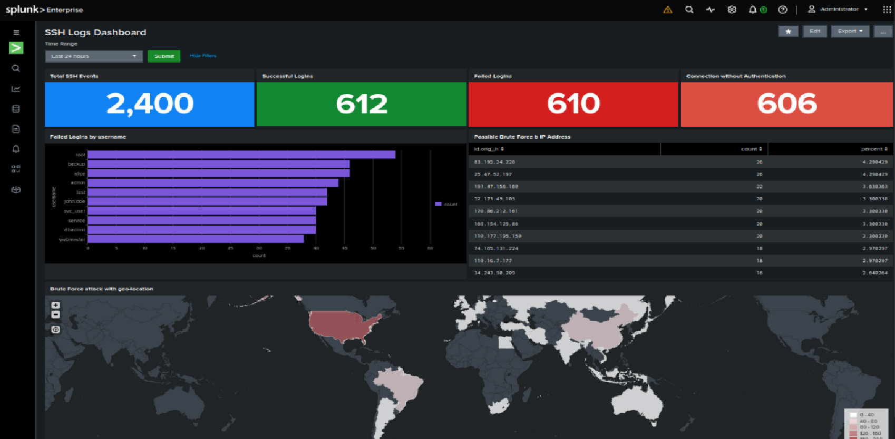
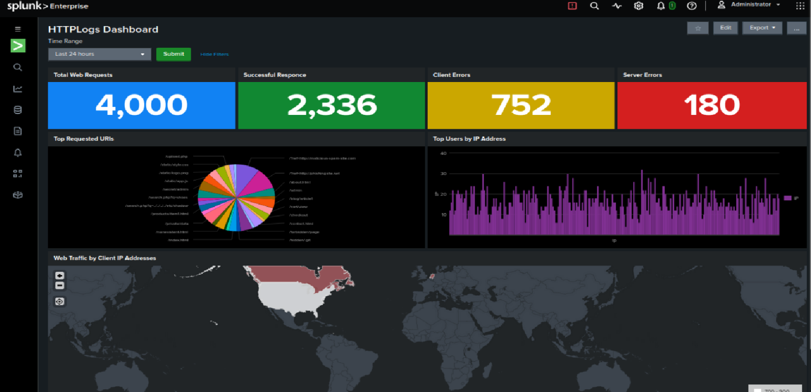

# Splunk Home Lab Dashboards

This directory contains the dashboards created for the Splunk Home Lab.

The dashboards provide a simple SOC-style view of Linux authentication activity and HTTP/web server activity collected by Splunk.

---

## 1. SSH Authentication Dashboard

The SSH Authentication Dashboard is used to monitor authentication activity on the Linux system.

### Monitored Activity

- Successful SSH logins
- Failed SSH login attempts
- Authentication activity over time
- Source IP addresses
- SSH-related authentication events

### Data Source

```text
/var/log/auth.log
```

### Splunk Index

```text
security_lab
```

### Example SPL Queries

#### Failed SSH Attempts

```spl
index=security_lab "Failed password"
| stats count by host
```

#### Successful SSH Logins

```spl
index=security_lab ("Accepted password" OR "Accepted publickey")
| stats count by host
```

#### Authentication Activity

```spl
index=security_lab sourcetype=linux_secure
| timechart count
```

#### Failed Authentication Over Time

```spl
index=security_lab "Failed password"
| timechart count
```

---

## 2. HTTP Logs Dashboard

The HTTP Logs Dashboard is used to monitor Apache web server activity.

### Monitored Activity

- HTTP requests
- HTTP status codes
- Client IP addresses
- Requested URLs
- HTTP errors
- HTTP request methods

### Data Source

```text
/var/log/apache2/access.log
```

### Splunk Index

```text
security_lab
```

### Example SPL Queries

#### HTTP Requests

```spl
index=security_lab sourcetype=access_combined
| timechart count
```

#### HTTP Status Codes

```spl
index=security_lab sourcetype=access_combined
| stats count by status
| sort - count
```

#### Top Client IPs

```spl
index=security_lab sourcetype=access_combined
| stats count by clientip
| sort - count
| head 10
```

#### Most Requested URLs

```spl
index=security_lab sourcetype=access_combined
| stats count by uri_path
| sort - count
| head 10
```

#### HTTP Errors

```spl
index=security_lab sourcetype=access_combined status>=400
| stats count by status
| sort - count
```

#### HTTP Methods

```spl
index=security_lab sourcetype=access_combined
| stats count by method
```

---

## 3. Dashboard Purpose

These dashboards are designed to provide basic SOC monitoring and investigation capabilities.

They can be used to:

- Monitor authentication activity
- Identify repeated failed login attempts
- Review successful logins
- Monitor web traffic
- Identify HTTP errors
- Analyze client IP activity
- Investigate unusual patterns
- Practice Splunk SPL

---

## 4. Dashboard Screenshots

The completed dashboard screenshots are stored in the repository:

```text
../screenshots/ssh-logs-dashboard.png
../screenshots/http-logs-dashboard.png
```

### SSH Authentication Dashboard



### HTTP Logs Dashboard



---

## 5. Repository Structure

```text
dashboards/
└── README.md
```

Dashboard screenshots are stored separately:

```text
screenshots/
├── http-logs-dashboard.png
└── ssh-logs-dashboard.png
```
